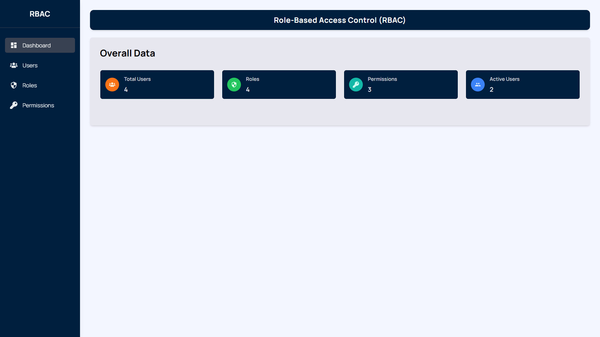
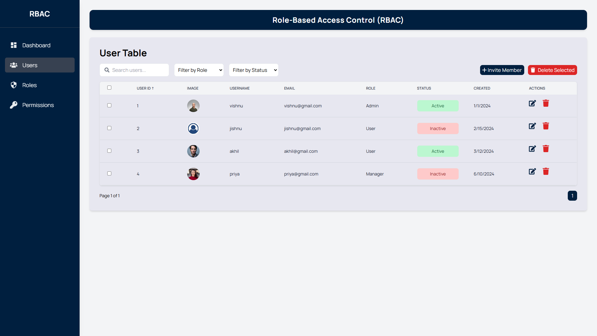
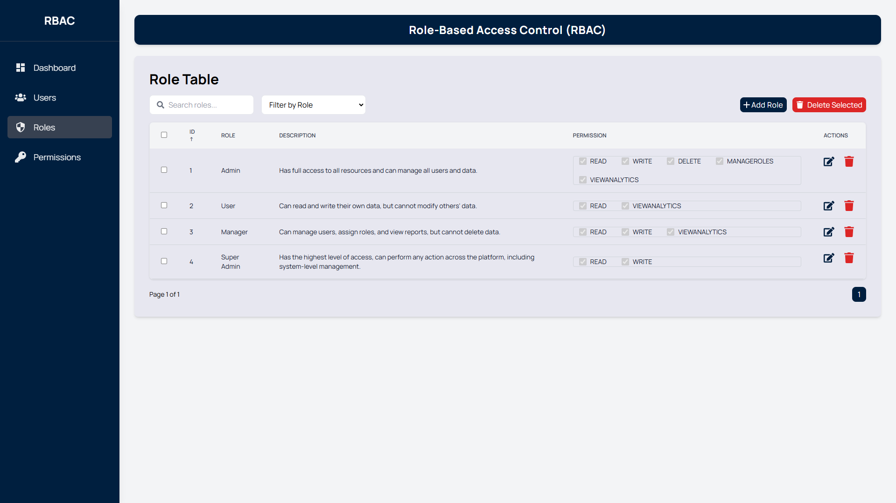
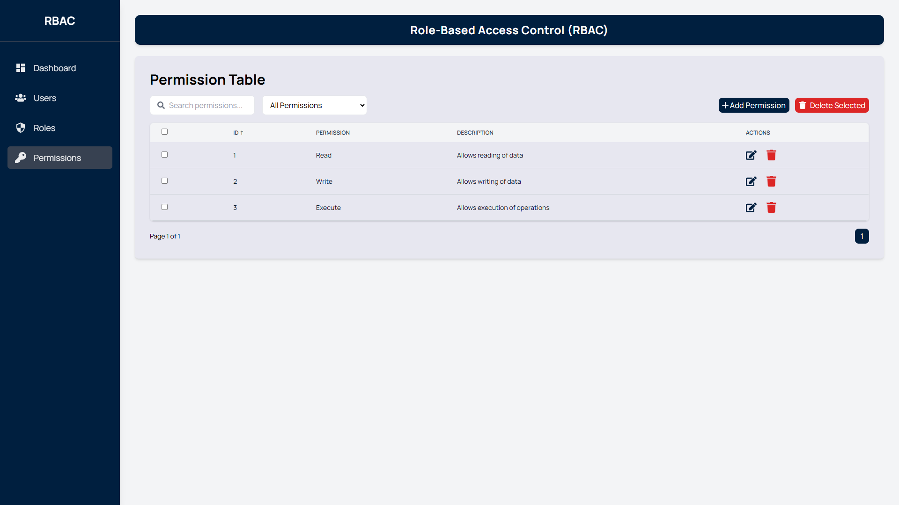

# **Role-Based Access Control (RBAC) UI**

This project is a **Role-Based Access Control (RBAC)** User Interface built as part of VRV Security's Frontend Developer Intern assignment. The application provides administrators with an intuitive and secure platform to manage users, roles, and permissions. Built using modern web technologies, the project focuses on creativity, functionality, and user experience.

---

## **Table of Contents**

1. [Project Overview](#project-overview)
2. [Features](#features)
3. [Additional Features](#additional-features)
4. [Technology Stack](#technology-stack)
5. [Setup Instructions](#setup-instructions)
6. [Live Demo](#live-demo)
7. [Screenshots](#screenshots)

---

## **Project Overview**

The **RBAC UI** allows administrators to perform key operations related to user, role, and permission management. It emphasizes a clean design, dynamic animations, and responsiveness to ensure seamless functionality across devices.

### **Core Requirements Addressed:**

- **User Management**: Add, edit, delete, and assign roles to users.
- **Role Management**: Define roles and manage associated permissions.
- **Dynamic Permissions**: Assign permissions dynamically to roles.
- **Smooth animations** using **Framer Motion** for a modern UI experience.

---

## **Features**

### **User Management**

- View a list of users in a responsive table format.
- Add, edit, or delete users dynamically.
- Assign roles and manage user statuses (e.g., Active/Inactive).

### **Role Management**

- Create, edit, or delete roles.
- Manage permissions for roles dynamically.
- Display permissions in an intuitive UI.

### **Permission Handling**

- Assign, remove, and customize permissions for specific roles.
- Modular permission categories (e.g., Read, Write, Delete).

### **UI/UX**

- Responsive design using **Tailwind CSS** for a seamless experience across all devices.
- Animations powered by **Framer Motion** for smooth transitions and user feedback.

---

## **Additional Features**

Here are some planned features that can further improve the application:

- **Sorting and Filtering**: Add sorting and filtering for users, roles, and permissions.
- **Search Functionality**: Global search for easier navigation.
- **Audit Logs**: Track changes to roles, users, and permissions.
- **Pagination**: Implement pagination to improve the handling of large datasets, making navigation easier when viewing long lists of users, roles, and permissions.
- **Multiple Select to Delete**: Allow administrators to select multiple users, roles, or permissions at once and delete them in bulk for better management.

---

## **Technology Stack**

- **Frontend Framework**: [React](https://reactjs.org/) with [Vite](https://vitejs.dev/) for fast development.
- **Styling**: [Tailwind CSS](https://tailwindcss.com/) for modern and responsive UI.
- **Animations**: [Framer Motion](https://www.framer.com/motion/) for dynamic and smooth animations.
- **Hosting**: [Vercel](https://vercel.com/) for fast and reliable deployment.
- **Icons**: React Icons for a clean visual design.

---

## **Setup Instructions**

To run the project locally, follow these steps:

### **Prerequisites**

- Node.js installed (v16+)
- Git installed

### **Installation**

1. Clone the repository:

   ```bash
   git clone https://github.com/vishnukkrishna/RBAC-VRV-Security.git
   cd RBAC-VRV-Security

   ```

2. Install dependencies:

   ```bash
   npm install

   ```

3. Start the development server:

   ```bash
   npm run dev

   ```

4. Open your browser and navigate to:
   ```bash
   http://localhost:5173
   ```

## **Live Demo**:

**The application is live and can be accessed here**:

[**RBAC UI Live**](https://rbac-vrv-security.vercel.app)

## **Screenshots**

### Dashboard



### User Management



### Role Management



### Permission Management


